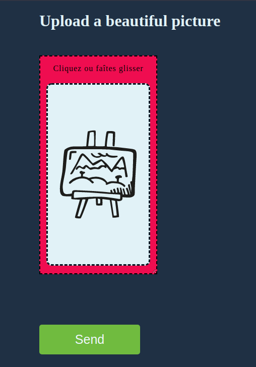

# vue3-image-input

File input for Vue 3.
=======
This enhanced file input enable to pick a file with a preview.

Support preview for :
* **Image** : jpg, png, svg...
* **Video** : preview for mp4, webm and all other browser compatible format
* **Audio**
* **PDF**




# Install
```
npm i vue3-image-input
```
# Usage
1.  Import the *ImageInput* component
```js
import { ImageInput } from 'vue3-image-input'
```
2. Import style.css
      * in style block of your SFC (don't work with *scoped* attribute).
        ```css
        @import '/node_modules/vue3-image-input/dist/style.css';
        ```
      * or in the ```<script setup>```
        ```js
        import '/node_modules/vue3-image-input/dist/style.css'
        ```
If you don't import the built-in CSS, the components will not be ergonomic and you will have to write your custom CSS.
3. Add the attribute **name** to the *ImageInput* component.

## Exemple in a SFC

```html
<template>
  <!-- an-app.vue -->
  <h2>Upload a picture</h2>
  
  
  <ImageInput 
      accept="image/*"
      textPlaceholder="Have you a picture ?"
      resizable
      name="picture-uploader"
      class="a-class" />

  <button type="submit">Submit</button>
</template>
```

```css
<style >
/* an-app.vue */
@import '/node_modules/vue3-image-input/dist/style.css';

.a-class {
  width: 200px;
  height: 400px;
  background-color: #ef0d50;
}
.a-class .preview {
  background-color: #e1f2f7;
  margin-top: 20px;
}

```

# Props
## Required
* ### accept
  * Default value : ```"image/*, audio/*, video/*"```
  * Type: ```string```
* ### name
  * Required prop
  * Equivalent to the *name* attribute in the tradutional form input.
  * Type: ```string```
---
## Optionals
* ### imagePlaceholder
  Custom image
  * Default value : built-in cover image*
* ### alt
* ### textPlaceholder
* ### resizable

---
# Events

# Licence
MIT
